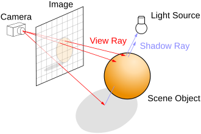

# Real-Time Raytracer

A high-performance, interactive raytracer built in C++ using the Walnut framework (Vulkan + Dear ImGui). Features real-time ray tracing with progressive accumulation, physically-based materials, and interactive scene editing.


## Table of Contents
1. [Features](#features)
2. [Technical Overview](#technical-overview)
3. [Core Components](#core-components)
4. [Ray Tracing Pipeline](#ray-tracing-pipeline)
5. [Mathematical Implementation](#mathematical-implementation)
6. [Performance Optimizations](#performance-optimizations)
7. [Build Instructions](#build-instructions)
8. [Usage](#usage)

## Features

- **Real-time Performance**: Interactive raytracing with immediate visual feedback
- **Accumulation Mode**: Temporal anti-aliasing through multi-frame accumulation
- **Material System**: Physically-based materials with albedo, roughness, and metallic properties
- **Multi-threading**: Architecture supports parallel execution for enhanced performance
- **Interactive Scene Editing**: Real-time parameter adjustment with immediate visual updates

## Technical Overview

This raytracer implements advanced computer graphics concepts including ray-sphere intersection, recursive ray bouncing, progressive accumulation, and physically-based material properties. Built on the Walnut framework, it leverages Vulkan for GPU-accelerated rendering and Dear ImGui for immediate-mode user interface.

The application follows a layered architecture with clear separation between rendering engine, scene management, and user interface:

- **Application Layer**: Walnut framework providing Vulkan backend and window management
- **UI Layer**: Dear ImGui integration for real-time parameter adjustment  
- **Rendering Engine**: Core raytracer with progressive accumulation
- **Scene Management**: Sphere primitives and material system

### Framework Integration
The project leverages the **Walnut Framework**, which provides:
- Vulkan-based rendering backend for GPU acceleration
- Dear ImGui integration for immediate-mode GUI
- Cross-platform window management and input handling
- Image creation and GPU texture management

## Core Components

### 1. Renderer Class
The heart of the raytracing engine, responsible for:
- **Ray Generation**: Creating primary rays from camera
- **Ray Tracing**: Implementing the core raytracing algorithm
- **Accumulation Buffer**: Managing progressive refinement
- **Color Processing**: Converting floating-point colors to RGBA format

```cpp
class Renderer {
private:
    std::shared_ptr<Walnut::Image> m_FinalImage;
    uint32_t* m_ImageData;           // Final pixel data
    glm::vec4* m_AccumulationData;   // Accumulation buffer
    uint32_t m_FrameIndex = 1;       // Progressive accumulation counter
};
```

### 2. Scene Management
The scene consists of:
- **Spheres**: Geometric primitives with position, radius, and material index
- **Materials**: PBR materials with albedo, roughness, and metallic properties
- **Camera**: View frustum and ray generation parameters

### 3. Material System
Physically-based material properties:
```cpp
struct Material {
    glm::vec3 Albedo;    // Base color/reflectance
    float Roughness;     // Surface roughness (0.0 = mirror, 1.0 = diffuse)
    float Metallic;      // Metallic workflow parameter
};
```

## Ray Tracing Pipeline




### 1. Ray Generation Phase

For each pixel (x, y):
1. Calculate ray origin from camera position
2. Compute ray direction using pre-calculated ray directions buffer
3. Initialize ray structure for tracing

### 2. Ray-Scene Intersection

**Sphere Intersection Algorithm**:
The renderer uses the quadratic formula to solve ray-sphere intersections:

- Uses discriminant test for intersection detection
- Calculates closest intersection point (smallest positive t)
- Handles multiple spheres with depth sorting

### 3. Shading and Material Response
For each intersection:
1. **Surface Normal Calculation**: `normal = normalize(hitPoint - sphereCenter)`
2. **Lighting Evaluation**: Simple directional light with dot product
3. **Material Application**: Modulate base color with lighting
4. **Reflection Ray Generation**: Use material roughness for ray scattering

### 4. Recursive Ray Bouncing

The raytracer supports up to 5 bounces with energy attenuation per bounce (multiplier *= 0.5f):

1. **Primary Ray**: Shot from camera through pixel
2. **Reflection Rays**: Generated at surface intersections  
3. **Energy Attenuation**: Each bounce reduces contribution
4. **Termination**: Bounce limit or miss (sky color)

## Mathematical Implementation

### Ray-Sphere Intersection Mathematics

We want to find out if a **ray** intersects a **sphere**, and if so, where.

### Ray
A **ray** is defined by:
```
r(t) = o + td
```
where:
- `o` = ray origin
- `d` = ray direction (normalized or not)
- `t` = parameter (distance along the ray)

### Sphere
A **sphere** is defined by:
```
||p - c||² = R²
```
where:
- `p` = point on the sphere
- `c` = sphere center
- `R` = radius

We want to solve for **t** such that the ray hits the sphere.

### Substituting the Ray into the Sphere Equation

Substitute `r(t)` into the sphere's equation:
```
||o + td - c||² = R²
```

Let:
```
oc = o - c
```

Then expand the squared norm:
```
(oc + td) · (oc + td) = R²
```

Expanding using dot product properties:
```
(oc · oc) + 2t(oc · d) + t²(d · d) = R²
```

Rearranged:
```
t²(d · d) + 2t(oc · d) + (oc · oc - R²) = 0
```

This is a **quadratic equation** in terms of `t`:
```
at² + bt + c = 0
```

Where:
- `a = d · d`
- `b = 2(oc · d)`
- `c = oc · oc - R²`

### Implementation

From my `TraceRay()` function:

```cpp
glm::vec3 origin = ray.Origin - sphere.Position;
float a = glm::dot(ray.Direction, ray.Direction);           // d·d
float b = 2.0f * glm::dot(origin, ray.Direction);           // 2(oc·d)
float c = glm::dot(origin, origin) - sphere.Radius * sphere.Radius; // oc·oc - R²

float discriminant = b * b - 4.0f * a * c;
```

### Solving the Quadratic

If `discriminant < 0`, no real solutions → **miss**.

If `discriminant ≥ 0`, solve using the quadratic formula:
```
t = (-b ± √(b² - 4ac)) / (2a)
```

You pick the smaller (closer) solution for the **first point of intersection**:

```cpp
float closestT = (-b - glm::sqrt(discriminant)) / (2.0f * a);
```

This gives the first point of intersection along the ray.

### Progressive Accumulation Algorithm

**Temporal Anti-Aliasing through Frame Accumulation**:
```cpp
// Accumulate color samples
m_AccumulationData[pixelIndex] += currentFrameColor;

// Compute average
glm::vec4 finalColor = m_AccumulationData[pixelIndex] / (float)m_FrameIndex;
```

This technique reduces noise and improves image quality over time by averaging multiple samples per pixel.

## Performance Optimizations

### 1. Multi-threading Architecture
The code includes parallel execution:
```cpp
#define MT 0  // Multi-threading toggle
#if MT
std::for_each(std::execution::par, m_ImageVerticalIter.begin(), m_ImageVerticalIter.end(), 
    [this](uint32_t y) { /* Parallel row processing */ });
#endif
```

**Benefits of Parallel Processing**:
- Distributes pixel calculations across CPU cores
- Maintains thread-safe access to accumulation buffer
- Scales performance with available hardware threads

### 2. Memory Management Optimization
- **Contiguous Memory Layout**: Linear pixel buffer for cache efficiency
- **Dynamic Resizing**: Efficient buffer reallocation on viewport changes
- **Iterator Pre-allocation**: Reusable iteration vectors to avoid repeated allocations

### 3. Early Ray Termination
```cpp
if (payload.HitDistance < 0.0f) {
    // Sky/environment contribution
    glm::vec3 skyColor = glm::vec3(0.6f, 0.7f, 0.9f);
    color += skyColor * multiplier;
    break; // Terminate ray bouncing
}
```

## Rendering Features

### 1. Progressive Refinement
- **Accumulation Mode**: Builds up samples over multiple frames
- **Interactive Mode**: Immediate feedback for scene manipulation
- **Automatic Reset**: Frame index reset on camera movement

### 2. Material Properties
- **Albedo**: Base surface color/reflectance
- **Roughness**: Controls reflection sharpness (perfect mirror to completely diffuse)
- **Metallic**: Determines metallic vs. dielectric behavior

### 3. Interactive Scene Editing
Real-time parameter adjustment through Dear ImGui:
- Sphere position, radius, and material assignment
- Material property sliders (albedo, roughness, metallic)
- Render settings and performance monitoring

### 4. Sky/Environment Mapping
Simple procedural sky color for rays that miss all geometry:
```cpp
glm::vec3 skyColor = glm::vec3(0.6f, 0.7f, 0.9f); // Soft blue gradient
```

## Build Instructions

### Prerequisites
- **Visual Studio 2019+** or equivalent C++17 compiler
- **Vulkan SDK** for graphics API support  

### Dependencies
- **Walnut Framework**: Vulkan backend and Dear ImGui integration
- **GLM**: OpenGL Mathematics library for vector operations
- **C++17**: Modern language features and execution policies

### Running the application
1. Clone the repository in a local directory:
   ```bash
   git clone https://github.com/Anshuman-Dhillon/Real-Time-RayTracer.git
   ```

2. Navigate to the main folder (Raytracer) -> bin -> Release-windows-x86_64 -> RayTracer -> Run RayTracer.exe:

3. It won't work in the first run because imgui needs to create a configuration file, so place the windows/panels where you'd like (including the viewport), and then run RayTracer.exe again.

## Usage

### Controls
- **Mouse**: Click and drag to orbit around the scene
- **Scroll**: Zoom in/out  
- **Settings Panel**: Toggle accumulation mode and reset frame counter
- **Scene Panel**: Adjust sphere and material properties in real-time

### Performance Tips  
- Enable accumulation mode for highest quality (slower updates)
- Monitor frame times in the settings panel

## Project Structure
```
RayTracer/
├── src/
│   ├── Renderer.cpp      # Core raytracing implementation
│   ├── Renderer.h        # Renderer class definition  
│   ├── WalnutApp.cpp     # Application entry point and UI
│   ├── Camera.h/.cpp     # Camera system
│   └── Scene.h           # Scene data structures
├── external/
│   └── Walnut/           # Walnut framework
└── premake5.lua          # Build configuration
```

## Possible Future Improvements

- BVH acceleration structures for complex scenes
- Temporal and spatial denoising algorithms
- Advanced PBR materials with normal mapping
- Volumetric effects (fog, smoke, participating media)
- Area lights for soft shadows
- Post-processing pipeline (tone mapping, bloom, DOF)
- Asset streaming for large scenes

---

*This project demonstrates computer graphics programming, mathematical algorithm implementation, and rendering optimization. The implementation showcases proficiency in C++, graphics programming, and software development.*
